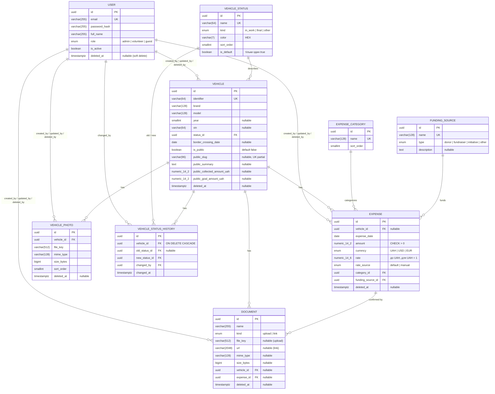

# База даних

> Джерело правди — TypeScript-схема у `apps/server/src/db/schema/*.ts`; згенеровані SQL-міграції лежать у
> `apps/server/drizzle/`. Цей файл описує фактичну схему й політики.

## СУБД

- **PostgreSQL 16** (Docker-образ `postgres:16-alpine`).
- Розширення `pgcrypto` (для `gen_random_uuid()`) вмикається в `docker/postgres/init.sql` і в першій
  міграції.
- Одна база на середовище: `volunteerfleet_dev`, `volunteerfleet_test`.

## ORM

**Drizzle ORM** з драйвером `node-postgres` (`pg`):

- схема описується в TS (`src/db/schema/*.ts`) — джерело правди;
- міграції генеруються через `drizzle-kit generate` (diff схеми проти snapshot) у `apps/server/drizzle/`;
- запити — через query builder (`db.select().from(...)`) або relational queries (`db.query.*`).

`apps/server/drizzle.config.ts`:

```ts
import type { Config } from 'drizzle-kit';

export default {
  schema: './src/db/schema/index.ts',
  out: './drizzle',
  dialect: 'postgresql',
  dbCredentials: { url: process.env.DATABASE_URL! },
} satisfies Config;
```

## Конвенції

- **Таблиці** — `snake_case`, множина (`users`, `vehicles`, `expense_categories`).
- **PK** — `uuid`, default `gen_random_uuid()`.
- **FK** — `<entity>_id uuid` з явною `onDelete`-політикою (див. нижче).
- **Таймстемпи** на кожній таблиці: `created_at`, `updated_at` (`timestamptz NOT NULL DEFAULT now()`;
  `updated_at` оновлюється через Drizzle `$onUpdate`).
- **Аудит-контекст**: `created_by`, `updated_by` (`uuid NOT NULL REFERENCES users(id)`); виставляє сервіс.
- **Soft delete** (де релевантно): `deleted_at timestamptz` + `deleted_by uuid` (nullable).
- **Грошові суми** — `numeric(14,2)`; **курси валют** — `numeric(14,6)`.
- Індекси на FK і часто-фільтровані поля створюються явно у схемі.

## Перелік таблиць

| Таблиця                  | Призначення                                 | Soft delete           |
| ------------------------ | ------------------------------------------- | --------------------- |
| `users`                  | Користувачі (admin / volunteer / guest).    | ✅                    |
| `vehicles`               | Транспортні засоби.                         | ✅                    |
| `vehicle_status_history` | Журнал переходів статусу авто.              | ❌ (історичні записи) |
| `vehicle_photos`         | Фото авто (галерея з порядком).             | ✅                    |
| `expenses`               | Витрати з валютою і збереженим курсом.      | ✅                    |
| `documents`              | Файли (`upload`) або зовнішні посилання.    | ✅                    |
| `vehicle_statuses`       | Довідник статусів авто (з `kind`, `color`). | ❌ (керує адмін)      |
| `expense_categories`     | Довідник категорій витрат.                  | ❌                    |
| `funding_sources`        | Довідник джерел фінансування.               | ❌                    |

## Детальна схема

### `users`

| Колонка                     | Тип                | Обмеження                 | Опис                              |
| --------------------------- | ------------------ | ------------------------- | --------------------------------- |
| `id`                        | uuid               | PK, `gen_random_uuid()`   |                                   |
| `email`                     | varchar(255)       | NOT NULL                  | Логін.                            |
| `password_hash`             | varchar(255)       | NOT NULL                  | bcrypt-хеш.                       |
| `full_name`                 | varchar(255)       | NOT NULL                  |                                   |
| `role`                      | `user_role` (enum) | NOT NULL                  | `admin` \| `volunteer` \| `guest` |
| `is_active`                 | boolean            | NOT NULL, default `true`  | Деактивація без видалення.        |
| `created_at` / `updated_at` | timestamptz        | NOT NULL, default `now()` |                                   |
| `deleted_at`                | timestamptz        | nullable                  | Soft delete.                      |

**Індекс:** `unique(email) WHERE deleted_at IS NULL` (partial — email можна перевикористати після видалення).

### `vehicles`

| Колонка                       | Тип                | Обмеження                                      | Опис                                              |
| ----------------------------- | ------------------ | ---------------------------------------------- | ------------------------------------------------- |
| `id`                          | uuid               | PK                                             |                                                   |
| `identifier`                  | varchar(64)        | NOT NULL                                       | Внутрішній номер запису.                          |
| `brand`                       | varchar(128)       | NOT NULL                                       |                                                   |
| `model`                       | varchar(128)       | NOT NULL                                       |                                                   |
| `year`                        | smallint           | nullable                                       |                                                   |
| `vin`                         | varchar(64)        | nullable                                       |                                                   |
| `status_id`                   | uuid               | FK → `vehicle_statuses.id`, RESTRICT, NOT NULL |                                                   |
| `description`                 | text               | nullable                                       |                                                   |
| `border_crossing_date`        | date               | nullable                                       | Дата перетину кордону (для імпортованих авто).    |
| `is_public`                   | boolean            | NOT NULL, default `false`                      | Чи доступна публічна read-only сторінка авто.     |
| `public_slug`                 | varchar(96)        | nullable                                       | Ідентифікатор для `/public/vehicles/:slug`.       |
| `public_summary`              | text               | nullable                                       | Короткий опис для публічної сторінки.             |
| `public_collected_amount_uah` | numeric(14,2)      | nullable                                       | Публічна сума зібраного (якщо адмін веде вручну). |
| `public_goal_amount_uah`      | numeric(14,2)      | nullable                                       | Ціль збору для публічного відображення.           |
| `created_by` / `updated_by`   | uuid               | FK → `users.id`, NOT NULL                      |                                                   |
| `created_at` / `updated_at`   | timestamptz        | NOT NULL                                       |                                                   |
| `deleted_at` / `deleted_by`   | timestamptz / uuid | nullable                                       | Soft delete.                                      |

**Індекси:** `unique(identifier) WHERE deleted_at IS NULL`,
`unique(public_slug) WHERE public_slug IS NOT NULL AND deleted_at IS NULL`, `idx(status_id)`,
`idx(brand, model)`, `idx(lower(vin))`, `idx(is_public)`.

Публічні поля не замінюють внутрішню картку — вони обслуговують лише сценарій «анонім переглядає публічну
сторінку авто» без розкриття приватних витрат, документів і службових полів ([ADR-016](architecture-decisions.md#adr-016-публічний-read-only-контур-як-окремі-санітизовані-dto)).

### `vehicle_statuses` (довідник)

| Колонка                     | Тип                            | Опис                                                     |
| --------------------------- | ------------------------------ | -------------------------------------------------------- |
| `id`                        | uuid PK                        |                                                          |
| `name`                      | varchar(64) UNIQUE NOT NULL    | Назва (керує адмін).                                     |
| `kind`                      | `vehicle_status_kind` enum     | `in_work` \| `final` \| `other` — бізнес-семантика.      |
| `color`                     | varchar(7) NOT NULL            | HEX-колір для тегів/прогресу; CHECK `^#[0-9A-Fa-f]{6}$`. |
| `sort_order`                | smallint NOT NULL DEFAULT 0    |                                                          |
| `is_default`                | boolean NOT NULL DEFAULT false | Стартовий статус нового авто.                            |
| `created_at` / `updated_at` | timestamptz                    |                                                          |

`kind` відокремлює бізнес-логіку від назви: дашборд рахує «в роботі» (`in_work`) і «передано» (`final`)
за `kind`, тож адмін може перейменовувати статуси без ризику зламати аналітику ([ADR-011](architecture-decisions.md#adr-011-бізнес-семантика-статусу-через-vehicle_status_kind)).
**Constraint:** лише один `is_default = true` — `unique(is_default) WHERE is_default`.

### `vehicle_status_history`

| Колонка         | Тип         | Обмеження                                 |
| --------------- | ----------- | ----------------------------------------- |
| `id`            | uuid        | PK                                        |
| `vehicle_id`    | uuid        | FK → `vehicles.id`, **CASCADE**, NOT NULL |
| `old_status_id` | uuid        | FK → `vehicle_statuses.id`, nullable      |
| `new_status_id` | uuid        | FK → `vehicle_statuses.id`, NOT NULL      |
| `changed_by`    | uuid        | FK → `users.id`, NOT NULL                 |
| `note`          | text        | nullable                                  |
| `changed_at`    | timestamptz | NOT NULL, default `now()`                 |

**Індекс:** `idx(vehicle_id, changed_at)`. Запис створюється автоматично сервісом при зміні `status_id` авто.

### `vehicle_photos`

| Колонка                     | Тип                | Обмеження                              | Опис                         |
| --------------------------- | ------------------ | -------------------------------------- | ---------------------------- |
| `id`                        | uuid               | PK                                     |                              |
| `vehicle_id`                | uuid               | FK → `vehicles.id`, RESTRICT, NOT NULL |                              |
| `file_key`                  | varchar(512)       | NOT NULL                               | Ключ об'єкта в MinIO/S3.     |
| `mime_type`                 | varchar(128)       | NOT NULL                               | Лише image-MIME з whitelist. |
| `size_bytes`                | bigint             | NOT NULL                               |                              |
| `sort_order`                | smallint           | NOT NULL DEFAULT 0                     | Порядок у галереї.           |
| `created_by` / `updated_by` | uuid               | FK → `users.id`, NOT NULL              |                              |
| `created_at` / `updated_at` | timestamptz        | NOT NULL                               |                              |
| `deleted_at` / `deleted_by` | timestamptz / uuid | nullable                               | Soft delete.                 |

**Індекси:** `idx(vehicle_id)`, `idx(vehicle_id, sort_order)`. Ліміт 10 активних фото на авто
перевіряється у транзакції з блокуванням рядка авто ([ADR-012](architecture-decisions.md#adr-012-фото-авто--окрема-таблиця-vehicle_photos-а-не-документи)).

### `expenses`

| Колонка                     | Тип                    | Обмеження                                        | Опис                                            |
| --------------------------- | ---------------------- | ------------------------------------------------ | ----------------------------------------------- |
| `id`                        | uuid                   | PK                                               |                                                 |
| `vehicle_id`                | uuid                   | FK → `vehicles.id`, RESTRICT, nullable           |                                                 |
| `expense_date`              | date                   | NOT NULL                                         |                                                 |
| `amount`                    | numeric(14,2)          | NOT NULL, CHECK `> 0`                            | Сума у валюті `currency`.                       |
| `currency`                  | `currency_code` (enum) | NOT NULL                                         | `UAH` \| `USD` \| `EUR`                         |
| `rate`                      | numeric(14,6)          | NOT NULL, CHECK `> 0`                            | Курс до UAH; для UAH = `1`.                     |
| `rate_source`               | `rate_source` (enum)   | NOT NULL                                         | `default` (з файлу) \| `manual` (перезаписаний) |
| `category_id`               | uuid                   | FK → `expense_categories.id`, RESTRICT, NOT NULL |                                                 |
| `funding_source_id`         | uuid                   | FK → `funding_sources.id`, RESTRICT, NOT NULL    |                                                 |
| `description`               | text                   | nullable                                         |                                                 |
| `created_by` / `updated_by` | uuid                   | FK → `users.id`, NOT NULL                        |                                                 |
| `created_at` / `updated_at` | timestamptz            | NOT NULL                                         |                                                 |
| `deleted_at` / `deleted_by` | timestamptz / uuid     | nullable                                         | Soft delete.                                    |

**Індекси:** `idx(vehicle_id)`, `idx(expense_date)`, `idx(funding_source_id)`, `idx(category_id)`.
Мультивалюта — у [currency.md](currency.md).

### `documents`

| Колонка                     | Тип                    | Обмеження                              | Опис                                    |
| --------------------------- | ---------------------- | -------------------------------------- | --------------------------------------- |
| `id`                        | uuid                   | PK                                     |                                         |
| `name`                      | varchar(255)           | NOT NULL                               | Людинозчитувана назва.                  |
| `kind`                      | `document_kind` (enum) | NOT NULL                               | `upload` \| `link`                      |
| `file_key`                  | varchar(512)           | nullable                               | Ключ об'єкта в MinIO/S3 (для `upload`). |
| `url`                       | varchar(2048)          | nullable                               | URL ресурсу (для `link`).               |
| `mime_type`                 | varchar(128)           | nullable                               | Для `upload`.                           |
| `size_bytes`                | bigint                 | nullable                               | Для `upload`.                           |
| `vehicle_id`                | uuid                   | FK → `vehicles.id`, RESTRICT, nullable |                                         |
| `expense_id`                | uuid                   | FK → `expenses.id`, RESTRICT, nullable |                                         |
| `created_by` / `updated_by` | uuid                   | FK → `users.id`, NOT NULL              |                                         |
| `created_at` / `updated_at` | timestamptz            | NOT NULL                               |                                         |
| `deleted_at` / `deleted_by` | timestamptz / uuid     | nullable                               | Soft delete.                            |

**Чек-обмеження:**

- `kind = 'upload'` → `file_key IS NOT NULL AND url IS NULL`; `kind = 'link'` → навпаки.
- `vehicle_id IS NOT NULL OR expense_id IS NOT NULL` — документ прив'язаний хоча б до одного об'єкта.

**Індекси:** `idx(vehicle_id)`, `idx(expense_id)`. Призначення (загальний / документ витрати) виводиться з
наявності `expense_id` ([ADR-013](architecture-decisions.md#adr-013-призначення-документа-виводиться-з-expense_id-а-не-зберігається-окремим-полем)).

### Довідники `expense_categories` / `funding_sources`

`expense_categories`: `id`, `name varchar(128) UNIQUE`, `sort_order`, таймстемпи.
`funding_sources`: `id`, `name varchar(128) UNIQUE`, `type funding_source_type enum`
(`donor` \| `fundraiser` \| `initiative` \| `other`), `description text`, таймстемпи.

## Enums

```sql
CREATE TYPE user_role            AS ENUM ('admin', 'volunteer', 'guest');
CREATE TYPE vehicle_status_kind  AS ENUM ('in_work', 'final', 'other');
CREATE TYPE currency_code        AS ENUM ('UAH', 'USD', 'EUR');
CREATE TYPE rate_source          AS ENUM ('default', 'manual');
CREATE TYPE document_kind        AS ENUM ('upload', 'link');
CREATE TYPE funding_source_type  AS ENUM ('donor', 'fundraiser', 'initiative', 'other');
```

## ON DELETE — політики цілісності

| Зв'язок                                             | Політика | Чому                                                                       |
| --------------------------------------------------- | -------- | -------------------------------------------------------------------------- |
| `vehicles.status_id` → `vehicle_statuses.id`        | RESTRICT | Не видалити статус, що використовується.                                   |
| `expenses.category_id` → `expense_categories.id`    | RESTRICT | Те саме для категорії.                                                     |
| `expenses.funding_source_id` → `funding_sources.id` | RESTRICT | Те саме для джерела.                                                       |
| `expenses.vehicle_id` → `vehicles.id`               | RESTRICT | Авто з витратами фізично не видаляється (лише soft delete).                |
| `documents.vehicle_id` / `expense_id`               | RESTRICT | Те саме.                                                                   |
| `vehicle_photos.vehicle_id` → `vehicles.id`         | RESTRICT | Те саме.                                                                   |
| `vehicle_status_history.vehicle_id` → `vehicles.id` | CASCADE  | Якщо авто все ж фізично видалене — історія йде разом.                      |
| `*.created_by/updated_by/deleted_by` → `users.id`   | RESTRICT | Користувача не видаляють фізично (лише `is_active = false` + soft delete). |

## Soft delete: правила

- Виконується через сервіс: `SET deleted_at = now(), deleted_by = :userId`.
- Усі SELECT за замовчуванням додають `WHERE deleted_at IS NULL` (helper `notDeleted(table)`).
- Admin-only `?includeDeleted=true` повертає всі записи; `POST /<resource>/:id/restore` скасовує видалення.
- Файли у сховищі при soft delete не видаляються (cleanup — поза межами першої версії).

## Міграції

Цикл: змінити `src/db/schema/*.ts` → `pnpm db:generate` (drizzle-kit згенерує `drizzle/000X_*.sql`) →
перевірити SQL очима й закоммітити → `pnpm db:migrate`. Початкова `0000_init.sql` створює всі enums,
таблиці й індекси. Наявні міграції:

| Міграція                                | Що додає                                            |
| --------------------------------------- | --------------------------------------------------- |
| `0000_init.sql`                         | Базова схема: enums, всі таблиці, індекси, CHECK-и. |
| `0001_vehicle_photos.sql`               | Таблиця `vehicle_photos`.                           |
| `0002_vehicle_status_kind_color.sql`    | `vehicle_statuses.kind` + `color` (з backfill).     |
| `0003_vehicle_border_crossing_date.sql` | `vehicles.border_crossing_date`.                    |

## Seed-дані

- **`pnpm db:seed`** (ідемпотентний) — admin із ENV (`ADMIN_EMAIL` / `ADMIN_PASSWORD` / `ADMIN_NAME`,
  пароль хешується bcrypt) + базові довідники: статуси авто (`знайдено` default, `куплено`, `в ремонті`,
  `готове`, `передано` з відповідними `kind`/`color`), категорії витрат, приклад джерела фінансування.

## Тестова база

Окрема БД `volunteerfleet_test`. Для unit-тестів сервісів `db`-клієнт мокається; для інтеграційних —
реальний PostgreSQL у Docker з очищенням перед прогоном.

## ER-діаграма


